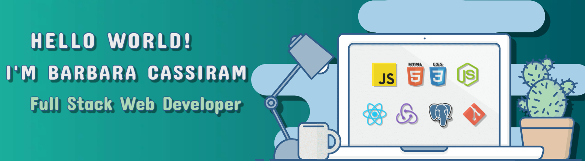

<h3 align="center">👩🏻‍💻Full Stack Web Developer</h3>

## About Me 

Hello🙋🏻, my name is Bárbara Cassiram and I am a Full Stack Web Developer oriented to Front End.

I have always been very self-taught, I like to learn something new every day and at the same time I like to share that knowledge with others, and I am always willing to offer my help to anyone who needs it. I like to look at myself in the mirror and know that every day I am better than the previous one.

I seek to contribute with creativity and innovation in achieving the overall goals of a company, developing myself through continuous learning and thus be able to acquire more experience and personal improvement.

## Languages and Tools:

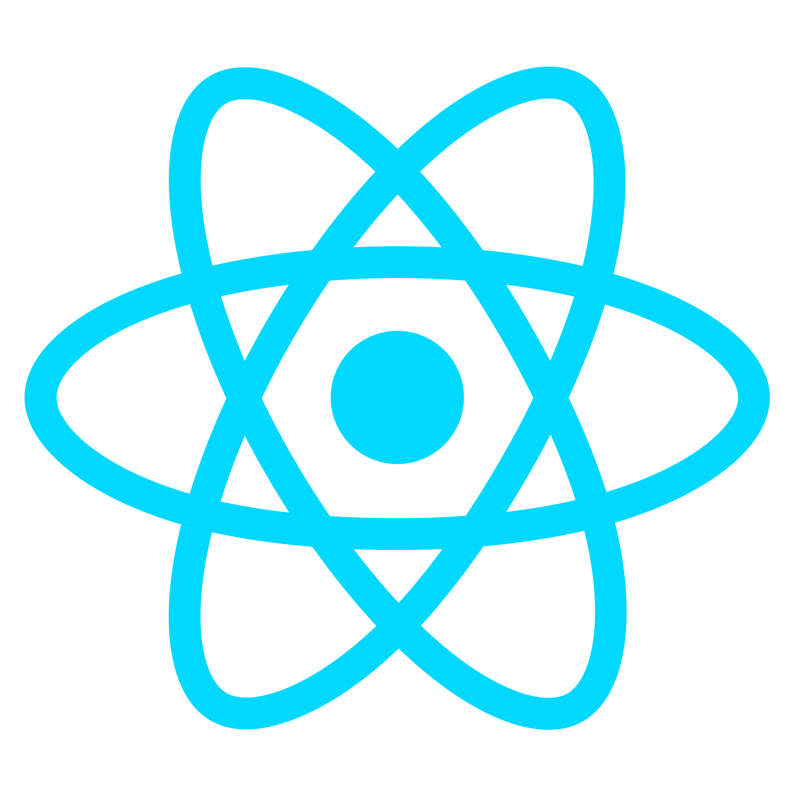
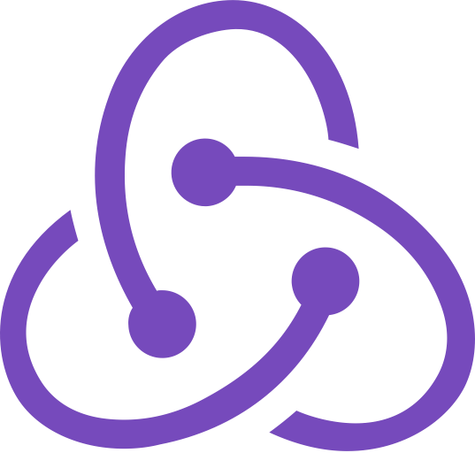
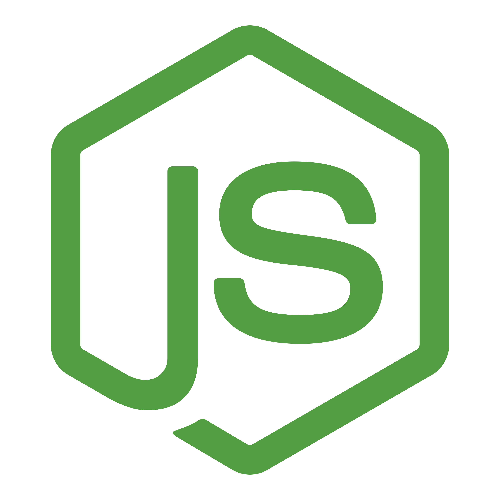

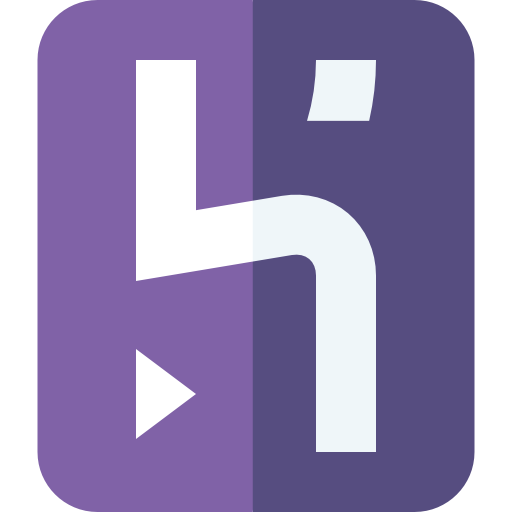
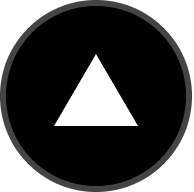

## Projects:

<a href="https://pi-dogs-byk.vercel.app/">Dogs App</a>
  

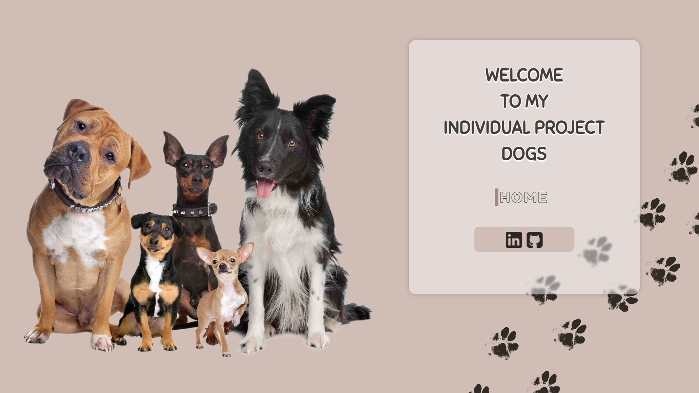

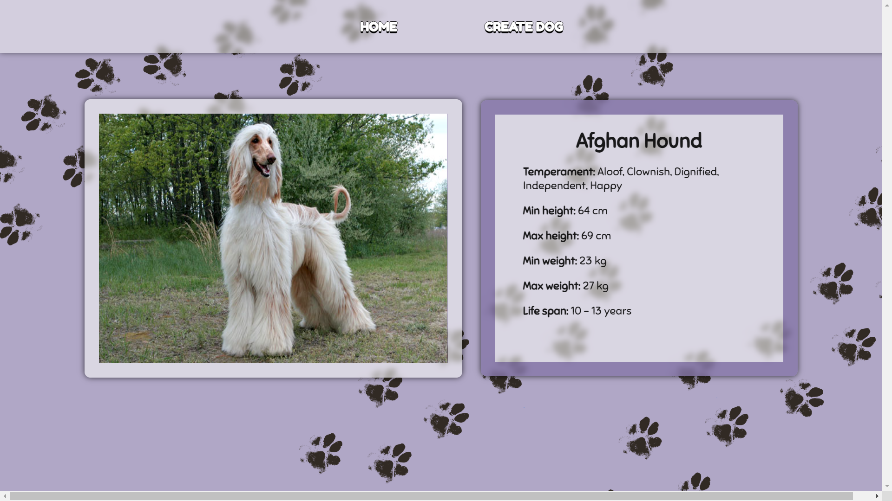
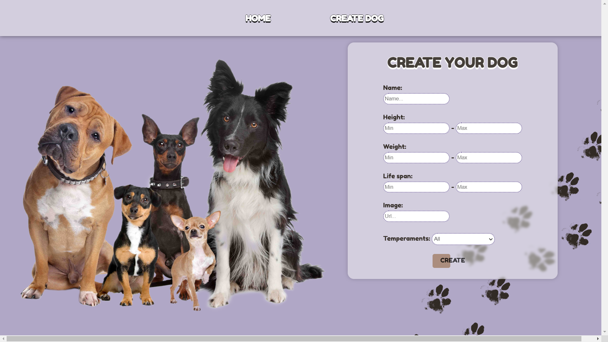

##

<a href="https://mi-scusi-books.vercel.app/">Mi Scusi Books App</a>
  

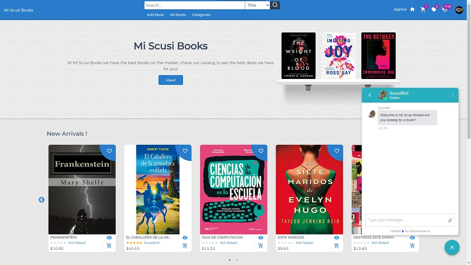
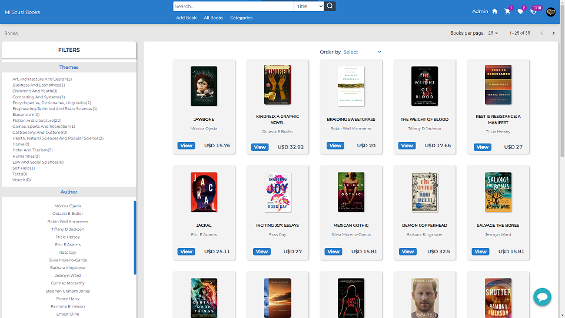
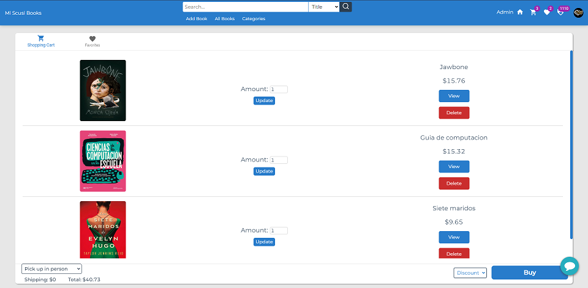
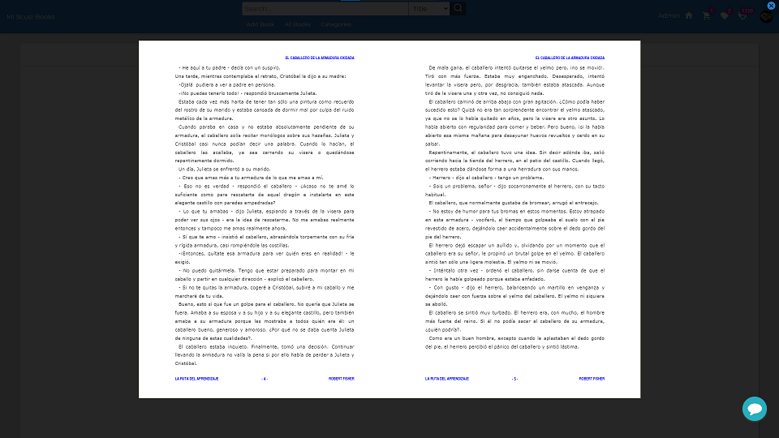

## GitHub Stats:

&nbsp;

## Connect with me: 

<a href="https://mail.google.com/mail/u/0/?fs=1&to=cassiram15@gmail.com&tf=cm">
&nbsp;&nbsp;&nbsp;&nbsp;

